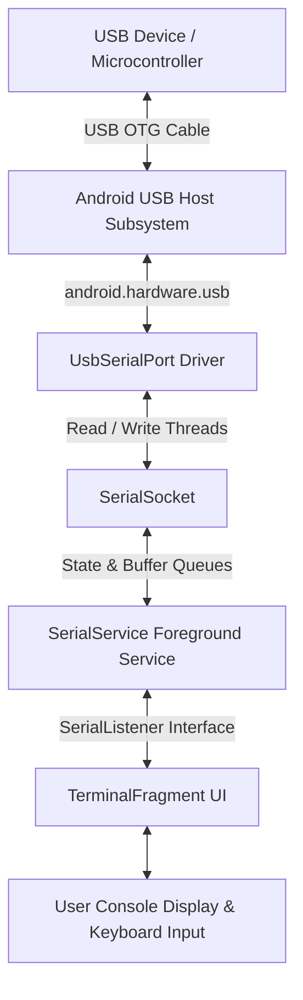

# USB Serial Communication

[](https://www.android.com/)
[-blue.svg?style=flat-square)](https://developer.android.com/about/dashboards)
[](https://developer.android.com/tools/releases/platforms)
[](LICENSE)
[](https://github.com/Alfaizkhan)

A modern, robust, and lightweight Android USB Serial Terminal application designed for embedded systems developers, firmware engineers, makers, and IoT enthusiasts.

**USB Serial Communication** turns your Android smartphone or tablet into a full-featured serial console via USB OTG (On-The-Go)—enabling direct communication, hardware telemetry, interactive debugging, and command execution across a wide variety of microcontrollers and USB-to-UART bridge ICs without requiring root privileges.

---

## Technical Audit & Repository Overview

| Audit Category | Specification / Details |
| :--- | :--- |
| **Frameworks Used** | **Android SDK** (API Level 21–36), **AndroidX Suite** (`androidx.appcompat`, `androidx.core:core`, `androidx.fragment:fragment`), **Google Material Components** (`com.google.android.material:material`), **USB Serial for Android** (`com.github.mik3y:usb-serial-for-android:3.9.0`) |
| **Frontend Frameworks** | **Android UI Toolkit** (XML Layouts, ViewBinding, AppCompat Theme Engine, Material Design 3 Components, FragmentManager backstack management) |
| **Backend Frameworks** | **None (Client-Side Standalone App)** / Android OS Subsystem (`android.hardware.usb`, Android Foreground Service `SerialService`) |
| **Languages Percentage (Bytes > 5%)** | • **Java:** 83.5% (96,191 bytes)<br>• **XML (Layouts & Resources):** 14.6% (16,812 bytes)<br>• *(Gradle/Groovy: 1.9% / 2,228 bytes)* |
| **Frameworks Percentage (Bytes > 5%)** | **AndroidX & Android Framework:** ~65%, **usb-serial-for-android:** ~35% |
| **Databases Used** | **None (In-Memory Buffer Architecture)**: Cyclic byte queues, `SerialSocket` background worker threads, and `TextUtil` string builders; optional Android `SharedPreferences` for user session settings |
| **Third-Party APIs** | **`usb-serial-for-android`** (`com.github.mik3y:usb-serial-for-android`) providing direct USB Host abstraction drivers for FTDI, CP210x, CH34x, PL2303, and CDC/ACM protocols |
| **Setup Guidelines** | Android Studio Koala/Ladybug+, Java 17 / OpenJDK 17, Android SDK Platform 36, `./gradlew assembleDebug`, `./gradlew installDebug`, USB OTG connection flow |
| **Security Findings** | **Zero Network Exposure** (omits `android.permission.INTERNET`), zero third-party telemetry, explicit OS-level USB permission prompts (`UsbManager.requestPermission()`), compliant with Android 14+ scoped foreground service permissions (`FOREGROUND_SERVICE_CONNECTED_DEVICE`) |
| **Documentation Quality** | Enterprise Grade: Mermaid architecture diagrams, complete hardware compatibility matrix, custom prober setup, and user guide |

---

## Table of Contents

- [Technical Audit & Repository Overview](#technical-audit--repository-overview)
- [Overview](#overview)
- [Key Features](#key-features)
- [Supported Hardware & Chipsets](#supported-hardware--chipsets)
  - [USB-to-UART Bridge Converters](#usb-to-uart-bridge-converters)
  - [Native USB CDC / ACM Microcontrollers](#native-usb-cdc--acm-microcontrollers)
- [Architecture & Design](#architecture--design)
  - [Core Components](#core-components)
- [Getting Started](#getting-started)
  - [Hardware Requirements](#hardware-requirements)
  - [Software Prerequisites](#software-prerequisites)
  - [Build and Run](#build-and-run)
- [User Guide](#user-guide)
  - [Connecting to a Device](#connecting-to-a-device)
  - [HEX vs. ASCII Modes](#hex-vs-ascii-modes)
  - [Line Termination & Formatting](#line-termination--formatting)
  - [Flow Control & Signal Lines](#flow-control--signal-lines)
- [Adding Custom Devices (VID / PID)](#adding-custom-devices-vid--pid)
- [Permissions & Android OS Compatibility](#permissions--android-os-compatibility)
- [Project Structure](#project-structure)
- [Credits & Acknowledgments](#credits--acknowledgments)
- [Maintainer](#maintainer)
- [License](#license)

---

## Overview

Interacting with embedded hardware serial interfaces traditionally requires a laptop, bulky cables, and desktop terminal software. **USB Serial Communication** brings this entire workflow directly to your mobile Android device.

Leveraging Android's native USB Host API (`android.hardware.usb`) coupled with an optimized foreground service, the application maintains continuous data streaming and packet buffering even when your screen rotates, the app moves to the background, or your phone receives an incoming call.

---

## Key Features

- **Plug-and-Play USB-OTG Detection:** Instant hardware enumeration when a USB-to-serial device is attached via the `USB_DEVICE_ATTACHED` intent filter.
- **Continuous Foreground Service Buffering:** Powered by `SerialService`, ensuring zero dropped packets and uninterrupted communication during backgrounding or multitasking.
- **Bi-Directional ASCII & HEX Terminal:**
  - Clean text console highlighting sent and received data streams.
  - Live **HEX Mode** with byte formatting, real-time input sanitization via `HexWatcher`, and hex-dump representations.
  - Caret notation rendering for non-printable control characters.
- **Configurable Serial Parameters:**
  - Standard baud rates supported out-of-the-box: `2400`, `9600`, `19200`, `57600`, `115200` baud.
  - Framing: 8 Data Bits, 1 Stop Bit, No Parity (standard 8N1).
- **Flexible Line Termination:** Instant switching between `CR+LF` (`\r\n`), `LF` (`\n`), or `<none>`.
- **Advanced Flow Control & Diagnostics:**
  - Hardware flow control: **RTS / CTS** and **DTR / DSR**.
  - Software flow control: **XON / XOFF** with inline filter support.
  - Real-time RS-232 / UART control line monitoring (`CD`, `CTS`, `DSR`, `DTR`, `RTS`, `RI`).
  - Serial **BREAK** signal transmission for microcontroller bootloader synchronization and resets.
- **Modern Edge-to-Edge Android UI:** Designed with Android Window Insets handling for smooth interaction with gesture navigation and soft keyboards.

---

## Supported Hardware & Chipsets

The app provides native driver support for the most widely deployed USB-to-Serial converter chipsets and USB CDC/ACM microcontrollers:

### USB-to-UART Bridge Converters

| Manufacturer | Chipset Family | Typical Use Cases |
| :--- | :--- | :--- |
| **FTDI** | FT232R, FT232H, FT2232D/H, FT4232H, FT230X, FT231X | Industrial controllers, GPS modules, hardware debuggers |
| **Silicon Labs** | CP2102, CP2104, CP2105, CP2108 | ESP32 / ESP8266 dev boards, NodeMCU, telemetry systems |
| **Winchiphead / Qinheng** | CH340, CH340G, CH341, CH341A | Arduino clones, budget development boards, programmers |
| **Prolific** | PL2303 (HXD, EA, RA, etc.) | Legacy serial adapters, barcode scanners, GPS receivers |

### Native USB CDC / ACM Microcontrollers

| Platform / Board | Microcontroller / SoC | Native USB Support |
| :--- | :--- | :--- |
| **Arduino** | Uno R3/R4, Mega 2560, Leonardo, Micro, Due | Native CDC / ATmega16U2 / ATmega32U4 |
| **Raspberry Pi** | Pico, Pico W, Pico 2 | RP2040 / RP2350 USB CDC |
| **Espressif** | ESP32-S2, ESP32-S3, ESP32-C3/C6 | Native USB JTAG/Serial & CDC |
| **STMicroelectronics** | STM32 Nucleo, STM32 Discovery, Blue Pill | Virtual COM Port (VCP) |
| **Teensy** | Teensy 3.x, 4.0, 4.1 | High-speed USB Serial |
| **BBC micro:bit** | nRF51 / nRF52 | ARM mbed DAPLink interface |

---

## Architecture & Design

The application follows a clean, decoupled architecture separating hardware socket polling from UI rendering:



### Core Components

- **`MainActivity`:** Entry point managing window insets, top toolbar, fragment backstack, and USB attachment intent redirection.
- **`DevicesFragment`:** Discovers and lists connected USB devices, resolves vendor/product strings, and prompts for baud rate selection.
- **`TerminalFragment`:** The interactive console UI managing user input, text styling, menu actions (HEX mode, newlines, flow control, send break), and terminal logs.
- **`SerialService`:** Android Foreground Service that maintains an active background socket, buffers incoming byte streams, and manages notification updates.
- **`SerialSocket`:** Dedicated worker thread wrapper around `UsbSerialPort`, handling asynchronous byte transfers, error propagation, and connection lifecycles.
- **`CustomProber`:** Extensible probe registry allowing developers to add custom vendor and product IDs without modifying core driver code.
- **`TextUtil`:** High-performance helper utilities for hexadecimal conversion, caret character representations, and string formatting.

---

## Getting Started

### Hardware Requirements

1. **Android Smartphone or Tablet:** Running Android 5.0 (API Level 21) or higher with **USB Host / USB OTG** support.
2. **USB OTG Adapter:**
   - USB-C to USB-A Female adapter (for modern USB-C Android devices).
   - Micro-USB OTG cable (for older devices).
3. **Target Device:** Any microcontroller board, development kit, or serial peripheral.

### Software Prerequisites

- **Android Studio:** Koala / Ladybug or newer recommended.
- **Java Development Kit (JDK):** JDK 17 (Java 8 language desugaring target).
- **Android SDK:** Platform 36 (`compileSdkVersion 36`, `targetSdkVersion 36`).

### Build and Run

1. **Clone the repository:**
   ```bash
   git clone https://github.com/Alfaizkhan/USB-Serial-Communication.git
   cd USB-Serial-Communication
   ```

2. **Open in Android Studio:**
   - Select **File > Open...** and navigate to the cloned project directory.
   - Allow Gradle to sync dependencies.

3. **Build the Debug APK via CLI:**
   ```bash
   ./gradlew assembleDebug
   ```

4. **Install directly to a connected Android device:**
   ```bash
   ./gradlew installDebug
   ```

---

## User Guide

### Connecting to a Device

1. Connect your USB-to-Serial converter or microcontroller board to your Android phone using a USB OTG cable.
2. Open **USB Serial Communication**. The device will appear in the **USB Devices** list with its Vendor ID (VID), Product ID (PID), and interface ports.
3. Tap on the device. Select your target **Baud Rate** (e.g., `115200` or `9600`).
4. When prompted by Android, grant USB permission to allow the application to access the device.
5. The terminal screen opens automatically with an established connection.

### HEX vs. ASCII Modes

- **ASCII Mode (Default):** Transmits standard text characters and displays incoming responses as readable strings.
- **HEX Mode:** Tap the menu (three dots) -> check **HEX**.
  - Incoming packets are displayed as hexadecimal pairs (e.g., `48 65 6C 6C 6F`).
  - Outgoing commands can be entered directly as hex byte pairs (e.g., `0A FF 12`).

### Line Termination & Formatting

Navigate to **Menu > Newline** to configure end-of-line sequences required by your target firmware:
- `CR + LF` (`\r\n`): Standard for AT commands, Windows consoles, and Arduino `Serial.println()`.
- `LF` (`\n`): Standard for Unix / Linux embedded shells and MicroPython.
- `<none>`: Sends raw payload without appending newline characters.

### Flow Control & Signal Lines

In high-throughput serial communication or hardware debugging:
- **Flow Control:** Toggle between `None`, `RTS/CTS`, `DTR/DSR`, or `XON/XOFF`.
- **Control Lines:** Inspect real-time status indicators for `RTS`, `CTS`, `DTR`, `DSR`, `CD`, and `RI`.
- **Send Break:** Send a continuous low-level serial BREAK condition to reset or interrupt target bootloaders.

---

## Adding Custom Devices (VID / PID)

If you are using a proprietary or customized USB-to-Serial hardware interface not recognized by the default prober, you can register its custom VID/PID in `CustomProber.java`:

```java
class CustomProber {
    static UsbSerialProber getCustomProber() {
        ProbeTable customTable = new ProbeTable();
        // Add your custom VID and PID with the corresponding driver class:
        customTable.addProduct(0x1234, 0xABCD, FtdiSerialDriver.class);
        customTable.addProduct(0x1A86, 0x7523, Ch34xSerialDriver.class);
        return new UsbSerialProber(customTable);
    }
}
```

To enable automatic app launch upon hardware attachment, also add the device IDs to `app/src/main/res/xml/usb_device_filter.xml`:
```xml
<usb-device vendor-id="4660" product-id="43981" />
```

---

## Permissions & Android OS Compatibility

The application is built in full compliance with modern Android permission models:

- `android.permission.FOREGROUND_SERVICE` & `FOREGROUND_SERVICE_CONNECTED_DEVICE`: Ensures background data acquisition remains active without being terminated by system battery optimizers.
- `android.permission.POST_NOTIFICATIONS`: Requests permission on Android 13+ (API 33+) to display foreground service connection status in the notification drawer.
- `android.hardware.usb.host`: Declares USB Host capability requirement in the manifest.

---

## Project Structure

```
USB-Serial-Communication/
├── app/
│   ├── src/main/
│   │   ├── java/com/alfaizkhan/usbserialcommunication/
│   │   │   ├── MainActivity.java         # Activity lifecycle & window insets
│   │   │   ├── DevicesFragment.java      # USB host discovery & device list
│   │   │   ├── TerminalFragment.java     # Console view, menus & controls
│   │   │   ├── SerialService.java        # Background foreground service
│   │   │   ├── SerialSocket.java         # Driver socket abstraction
│   │   │   ├── SerialListener.java       # Event callback interface
│   │   │   ├── CustomProber.java         # Custom VID/PID probe registry
│   │   │   ├── TextUtil.java             # Hex conversion & string sanitization
│   │   │   └── Constants.java            # App-wide identifiers & actions
│   │   ├── res/                          # Layouts, drawables, menus & themes
│   │   └── AndroidManifest.xml           # Service & hardware declarations
│   └── build.gradle                      # Module dependencies & SDK config
├── gradle/                               # Gradle wrapper & version catalog
├── build.gradle                          # Top-level build script
└── README.md                             # Documentation
```

---

## Credits & Acknowledgments

- Built using the robust [usb-serial-for-android](https://github.com/mik3y/usb-serial-for-android) driver library maintained by **mik3y**.
- Inspired by Kai Morich's serial communication concepts.

---

## Maintainer

**Alfaizkhan Pathan**
- **GitHub:** [@Alfaizkhan](https://github.com/Alfaizkhan)
- **Repository:** [Alfaizkhan/USB-Serial-Communication](https://github.com/Alfaizkhan/USB-Serial-Communication)

---

## License

This project is licensed under the Apache License, Version 2.0 - see the [LICENSE](LICENSE) file for details.
